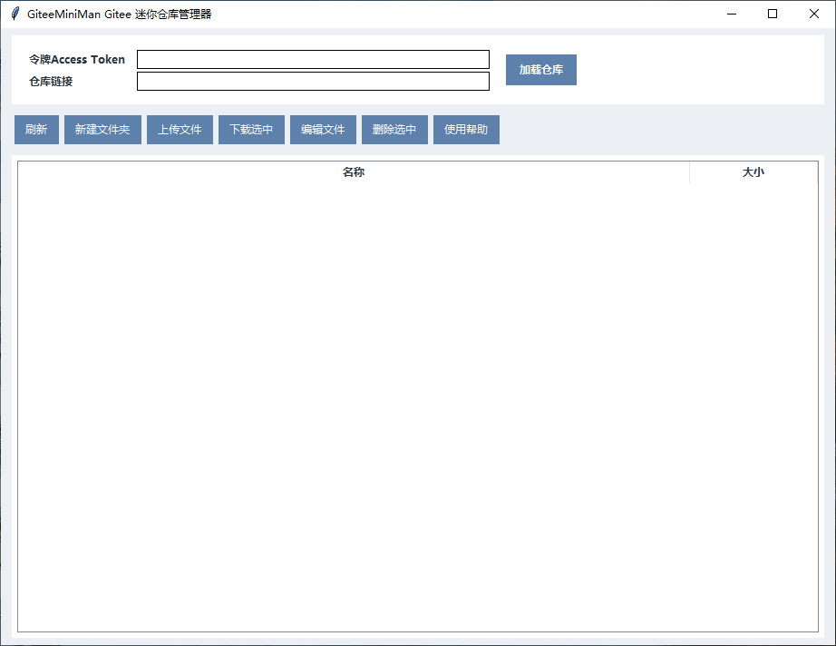

English Introduction

A lightweight, clean and easy-to-use visualization management tool for Gitee repositories. No command line required, with a pure graphical interface. It supports browsing, uploading, downloading, editing, deleting repository files, and encrypted token storage. Ideal for non-professional developers and individual developers to quickly manage Gitee code repositories.
https://gitee.com/api/v5/swagger

🌟 Project Introduction

GiteeMiniMan is a Gitee desktop client developed with Python + Tkinter, focusing on being lightweight and minimalist. It solves the problems of complicated command-line operations and bloated official clients.

Simply configure your Gitee personal access token, and you can manage repository files graphically. It supports online text file editing, uploading and downloading various file types, one-click folder creation and deletion, fully meeting daily repository management needs.

✨ Core Features

- Fast repository loading: parses Gitee repository URLs and loads the file directory tree with one click

- Full file lifecycle management: upload, download, delete, rename (via editing), create folders

- Online text editing: built-in code editor supporting dozens of text/code formats for real-time modification and submission

- Permission mode: with token = read/write access; without token = read-only mode, safe and flexible

- Data security: token stored locally with AES encryption, not saved in plaintext. Do NOT share the JSON config file when distributing the program to others

- Lightweight UI: clean and beautiful interface, no redundant functions, fast startup, low resource usage

- Auto-remember: automatically loads last used token and repository on restart

🖥️ Supported File Types

Almost all text-based files are supported:

txt, md, yaml, yml, xml, json, ini, py, sh, bat, html, css, js, vue, sql, env, java, c, cpp, etc.

Supports uploading any binary files: images, archives, documents, etc. (single file ≤ 10MB recommended)

🔧 System Requirements

- Runtime: Python 3.7+

- Dependencies: tkinter, requests, cryptography

- Supported OS: Windows

Install dependencies:

pip install requests cryptography

🚀 GiteeMiniMan Basic Instructions
Download GiteeMiniMan.py, run it in a Python environment, or package it into an EXE file for direct execution. Make sure to install required dependencies.
Open the Gitee website → Personal Settings → Security Settings → Private Token, and generate a token with repo permissions.
Paste the token and repository URL into the program input box, then click Load Repository to start using.

中文说明

GiteeMiniMan - Gitee 迷你仓库管理器

一款轻量、简洁、易用的Gitee 仓库可视化管理工具，无需命令行，纯图形化界面，轻松实现仓库文件浏览、上传、下载、编辑、删除等操作，支持令牌加密存储，适合非专业开发者、个人开发者快速管理 Gitee 代码仓库。
https://gitee.com/api/v5/swagger

🌟 项目简介

GiteeMiniMan 是基于 Python + Tkinter 开发的Gitee 桌面客户端工具，专注于轻量化、极简操作，解决命令行操作繁琐、官方客户端臃肿的问题。

你只需要配置 Gitee 私人令牌，即可图形化管理仓库文件，支持文本文件在线编辑、多类型文件上传下载、文件夹一键创建删除，完全满足日常仓库管理需求。

✨ 核心功能

- 仓库快速加载：支持 Gitee 仓库链接解析，一键加载文件目录树

- 文件全生命周期管理：上传、下载、删除、重命名（编辑间接实现）、新建文件夹

- 在线文本编辑：内置代码编辑器，支持几十种文本 / 代码格式实时修改并提交到仓库

- 权限模式：带令牌 = 读写权限，无令牌 = 只读模式，安全灵活

- 数据安全：令牌本地 AES 加密存储，不明文保存，保护账号安全。发送程序给他人使用时，不能发送json配置文件。

- 轻量化界面：简洁美观的 UI，无冗余功能，启动快、占用低

- 自动记忆：重启自动加载上次配置的令牌和仓库

🖥️ 支持编辑 / 上传的文件类型

几乎支持所有文本类文件：

txt、md、yaml、yml、xml、json、ini、py、sh、bat、html、css、js、vue、sql、env、java、c、cpp 等

支持任意二进制文件上传：图片、压缩包、文档等（建议单文件≤10MB）

🔧 使用环境

- 运行环境：Python 3.7+

- 依赖库：tkinter、requests、cryptography

- 系统支持：Windows 平台

安装依赖

运行以下命令安装所需依赖：

pip install requests cryptography

🚀 基本操作说明

1. 下载GiteeMiniMan.py，在python环境运行，或者直接打包exe后运行。注意安装依赖：pip install requests cryptography

2. 打开 Gitee网页 → 个人设置 → 安全设置 → 私人令牌，生成带repo权限的令牌。

3. 复制令牌和仓库链接到程序输入框中，点击加载仓库即可使用。
